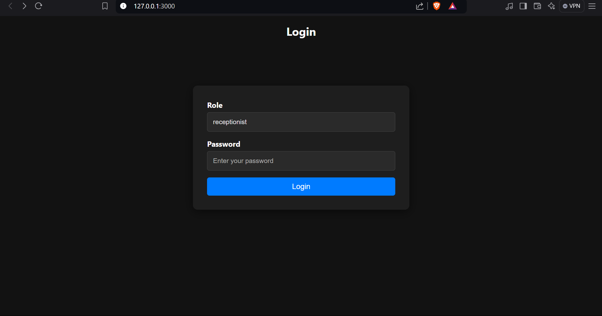
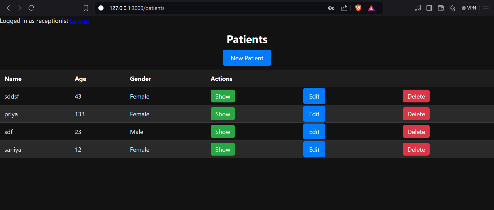
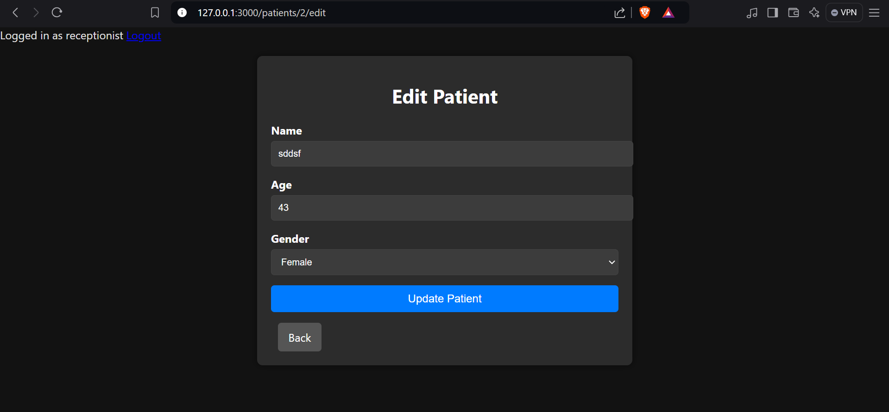
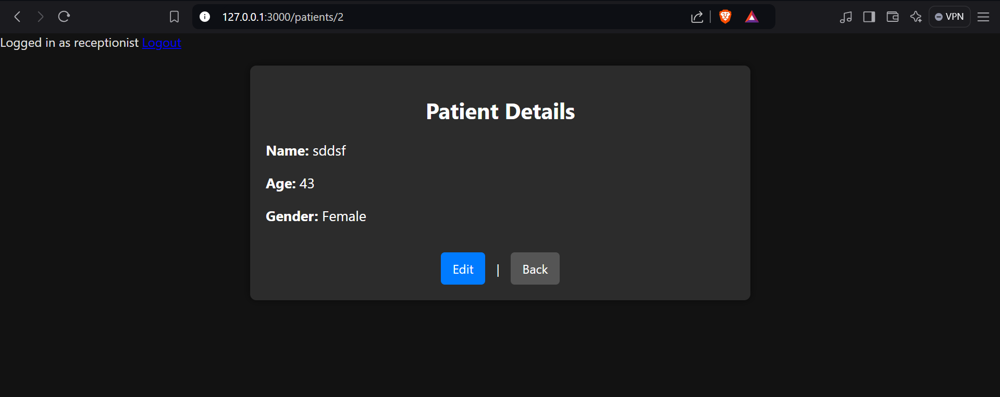
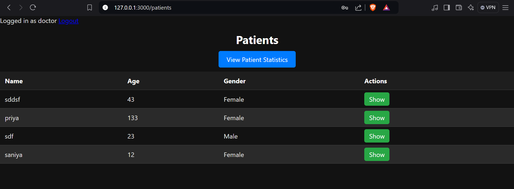
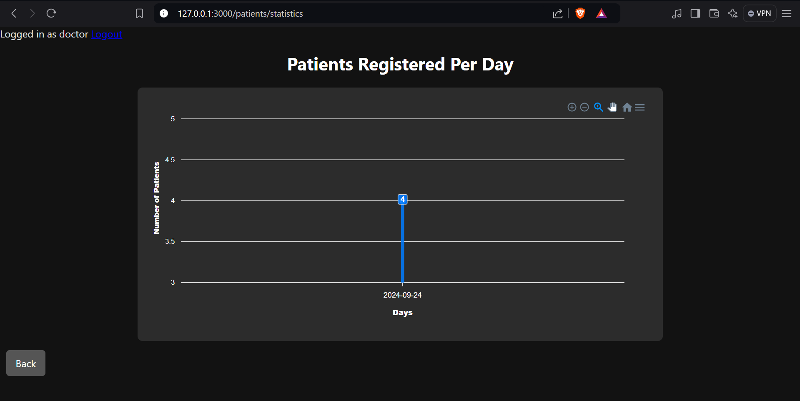

# Hospital Management System

A **Hospital Management System** built with Ruby on Rails, consisting of two portals: a **Receptionist** portal and a **Doctor** portal. The system allows receptionists to manage patient records (CRUD operations), and doctors to view registered patients and their registration statistics through a graphical representation.

## Table of Contents

- [Features](#features)
- [Technologies Used](#technologies-used)
- [Setup and Installation](#setup-and-installation)
- [Usage](#usage)
  - [Receptionist Portal](#receptionist-portal)
  - [Doctor Portal](#doctor-portal)
- [Patient Registration Chart](#patient-registration-chart)
- [Screenshots](#screenshots)
- [Credits](#credits)

---

## Features

- **Single login page** for both receptionists and doctors.
- **Receptionists** can:
  - Register a new patient.
  - Perform CRUD (Create, Read, Update, Delete) operations on patient data.
- **Doctors** can:
  - View a list of registered patients.
  - Access a **line chart** displaying the number of patients registered per day.

## Technologies Used

- **Ruby on Rails** - Backend framework.
- **PostgreSQL** - Database for storing patient data.
- **ApexCharts.js** - JavaScript library for rendering interactive charts.
- **HTML/CSS** - For designing professional, responsive user interfaces.
- **JavaScript** - For dynamic elements and chart functionality.

---

## Setup and Installation

### Prerequisites

- Ruby (version 3.0.0 or higher)
- Rails (version 6.0 or higher)
- PostgreSQL (installed and running)

### Installation Steps

1. Clone the repository:

   ```bash
   git clone https://github.com/your-username/hospital-management-system.git
   cd hospital-management-system
   ```

2. Install the required gems:

   ```bash
   bundle install
   ```

3. Set up the database:

   ```bash
   rails db:create
   rails db:migrate
   ```

4. Seed some initial data (optional):

   ```bash
   rails db:seed
   ```

5. Start the Rails server:

   ```bash
   rails server
   ```

6. Open your browser and navigate to:

   ```
   http://localhost:3000
   ```

---

## Usage

### Receptionist Portal

- Receptionists can log in with their credentials and access the **Patient Management** section.
- They can perform the following operations:
  - **Create** a new patient by clicking on the "New Patient" button.
  - **Edit** or **Delete** existing patients from the patients list.
  - View patient details by clicking on "Show".

### Doctor Portal

- Doctors can log in with their credentials and view all registered patients.
- They can access the **Patient Statistics** section to see a graphical representation of daily patient registrations.

---

## Patient Registration Chart

Doctors can view the number of patients registered per day through an interactive line chart created using **ApexCharts.js**. The chart is displayed on the **Patient Statistics** page, and the data is dynamically generated based on the number of patient registrations over time.

### Example Chart Data

The chart tracks the total patients registered per day, with the X-axis representing the days and the Y-axis representing the number of patients.

---

## Screenshots

### Login Page


### Patient Management for Receptionists


### Edit Page for Receptionists


### Edit Page for Register New User For Receptionist


### Viewing Patient Details


### Patient Management for Doctors


### Patient Registration Chart for Doctors



